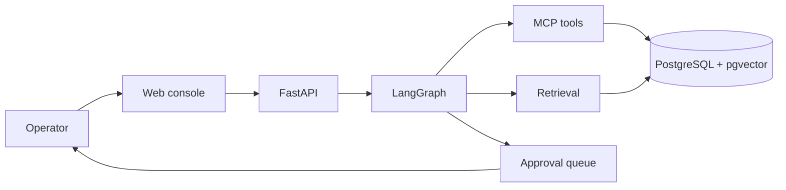
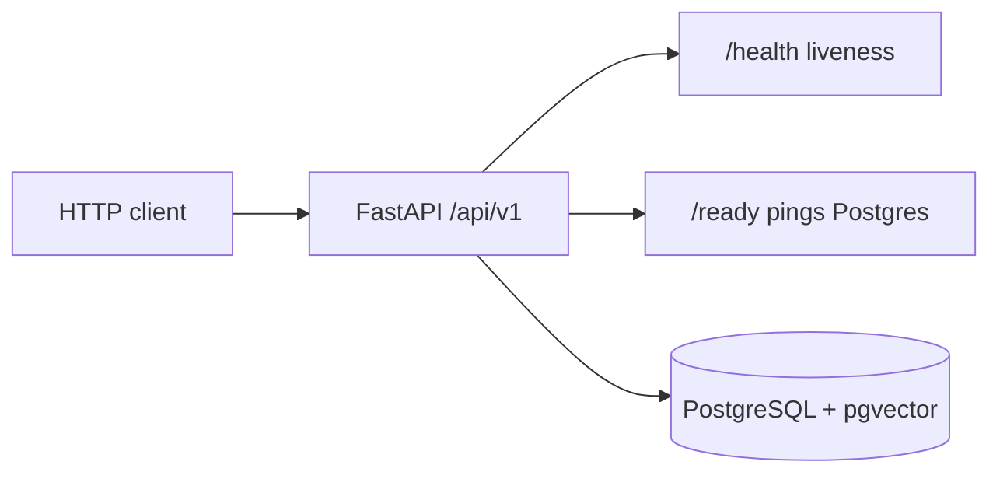

# ForgeFlow AI

Production-oriented industrial agentic AI platform. An engineer can submit an operational request; the system plans an investigation, gathers equipment telemetry, alarms, maintenance history, and technical documentation, produces an evidence-backed root-cause report, and pauses before high-impact actions for human approval.

**Current status: Milestone 0 (architecture and bootstrap).** The HTTP API, PostgreSQL, migrations, structured logging, tests, and Docker Compose core stack exist. The agent, MCP tools, RAG pipeline, authentication, and web console are not implemented yet.

## Problem

Industrial investigations mix noisy operational data, technical manuals, and write actions that must not run unchecked. A chatbot wrapper around an LLM cannot own that workflow: authorization, tool execution, evidence, approval, and audit have to be software systems, with the model used only where judgment is actually required.

## What works today

- FastAPI application with versioned health and readiness endpoints
- PostgreSQL 16 with the `vector` extension enabled via Alembic
- Environment-based configuration (including unused LLM provider settings reserved for Milestone 3)
- JSON structured logging with secret redaction
- Docker Compose for `postgres` and `api`
- pytest, ruff, mypy, and a GitHub Actions workflow

## What does not work yet

- LangGraph investigation workflow
- MCP tool servers
- RAG / document retrieval
- Human approval
- Authentication and RBAC
- React operations console
- Evaluation harness
- OpenTelemetry / Prometheus / Grafana

See [docs/architecture.md](docs/architecture.md) for the target design and [docs/local-development.md](docs/local-development.md) for setup.

## Architecture (target)



Milestone 0 implements only the API process, configuration, logging, and database bootstrap:



## Technology stack

| Area | Choice |
| --- | --- |
| API | Python 3.12+, FastAPI, Pydantic v2 |
| Data | PostgreSQL 16, pgvector, SQLAlchemy 2, Alembic |
| Packaging | Docker Compose |
| Quality | pytest, ruff, mypy, GitHub Actions |

## Quick start

Requirements: Docker Desktop (or another Compose-compatible Docker engine).

```bash
git clone <repository-url>
cd forgeflow-ai
cp .env.example .env
docker compose up --build
```

Then:

```bash
curl http://localhost:8000/api/v1/health
curl http://localhost:8000/api/v1/ready
```

Interactive API docs: [http://localhost:8000/docs](http://localhost:8000/docs)

Default local credentials in `.env.example` are for development only.

## Local checks (without Docker)

Python 3.12+ is required. On Windows, create a venv and install extras:

```powershell
python -m venv .venv
.\.venv\Scripts\Activate.ps1
python -m pip install -e ".[dev]"
ruff check forgeflow apps tests
ruff format --check forgeflow apps tests
mypy forgeflow apps
pytest
```

Integration readiness tests skip automatically when PostgreSQL is not reachable.

## Demo scenario

The CNC-042 overheating investigation is scheduled for Milestone 1 (synthetic data) and Milestone 3 (first agent run). It is not runnable in Milestone 0.

## License

MIT. See [LICENSE](LICENSE).
