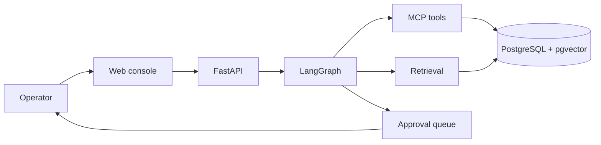
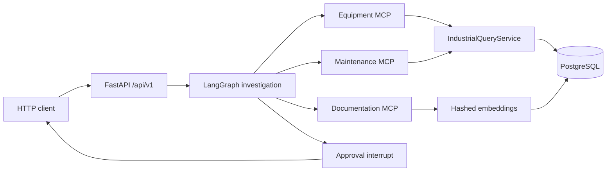

# ForgeFlow AI

Production-oriented industrial agentic AI platform. An engineer can submit an operational request; the system plans an investigation, gathers equipment telemetry, alarms, maintenance history, and relevant manual sections through MCP tools, then pauses for human approval before creating a work order.

**Current status: Milestone 5 (retrieval + human approval).** RAG over fictional manuals and a LangGraph interrupt/resume path for `create_work_order` are implemented. Authentication and the web console are not.

## Problem

Industrial investigations mix noisy operational data, technical manuals, and write actions that must not run unchecked. A chatbot wrapper around an LLM cannot own that workflow: authorization, tool execution, evidence, approval, and audit have to be software systems, with the model used only where judgment is actually required.

## What works today

- FastAPI application with versioned health, readiness, equipment history, investigation, and approval endpoints
- PostgreSQL 16 with pgvector, industrial tables, ingested manual chunks, and optional LangGraph checkpoints
- Deterministic synthetic seed for five fictional machines, including CNC-042, plus fictional manuals
- MCP tools `get_equipment`, `get_sensor_history`, `get_alarm_history`, `get_maintenance_history`, `search_documentation`, and `create_work_order`
- LangGraph investigation: request → plan → retrieve operational data and manuals → evidence → report → propose write → interrupt → execute
- Hashed embeddings (no paid embedding API) stored with pgvector; unit tests search an in-memory index of the same corpus
- Deterministic approval policy: `create_work_order` is denied until a human approval grants that investigation's idempotency key
- LLM provider abstraction for OpenAI, Ollama, and an in-process mock (tests never call a paid API)
- Environment-based configuration
- JSON structured logging with secret redaction
- Docker Compose for `postgres` and `api`
- pytest, ruff, mypy, and a GitHub Actions workflow

## What does not work yet

- Authentication and RBAC
- React operations console
- Evaluation harness
- OpenTelemetry / Prometheus / Grafana

See [docs/architecture.md](docs/architecture.md) for the target design and [docs/local-development.md](docs/local-development.md) for setup.

## Architecture (target)



Milestone 5 implements retrieval and human approval:



## Technology stack

| Area | Choice |
| --- | --- |
| API | Python 3.12+, FastAPI, Pydantic v2 |
| Data | PostgreSQL 16, pgvector, SQLAlchemy 2, Alembic |
| Tools | MCP (`mcp` SDK) wrapping industrial queries and retrieval |
| Agent | LangGraph explicit state graph with interrupt + checkpointer |
| LLM | OpenAI, Ollama, or in-process mock |
| Embeddings | Deterministic hashed vectors (256-d); no paid embedding API |
| Packaging | Docker Compose |
| Quality | pytest, ruff, mypy, GitHub Actions |

## Quick start

Requirements: Docker Desktop (or another Compose-compatible Docker engine).

```bash
git clone <repository-url>
cd forgeflow-ai
cp .env.example .env
docker compose up --build
docker compose exec api python -m forgeflow.domain.seed --reset
```

Then:

```bash
curl http://localhost:8000/api/v1/health
curl http://localhost:8000/api/v1/ready
curl http://localhost:8000/api/v1/equipment/CNC-042
curl -X POST http://localhost:8000/api/v1/investigations \
  -H "Content-Type: application/json" \
  -d "{\"request\":\"Investigate overheating on CNC-042\"}"
```

A CNC-042 investigation returns `status: awaiting_approval` and cites the fictional cooling manual. Approve or reject:

```bash
curl http://localhost:8000/api/v1/approvals
curl -X POST http://localhost:8000/api/v1/approvals/<investigation_id>/approve \
  -H "Content-Type: application/json" \
  -d "{\"decision\":\"approve\"}"
```

The investigation endpoint uses `LLM_PROVIDER` from `.env`. The Compose default is Ollama; set `LLM_PROVIDER=mock` to run without a model server. Tests always use the mock provider. Compose sets `CHECKPOINT_BACKEND=postgres`; the default test suite uses in-memory checkpoints.

Interactive API docs: [http://localhost:8000/docs](http://localhost:8000/docs)

Default local credentials in `.env.example` are for development only.

## Demo scenario

CNC-042 (ForgeMach FX-400) has a planted last-30-day pattern:

- rising temperature
- declining coolant flow
- nine `TEMP_HIGH` alarms
- overdue cooling-system inspection
- no open work order for cooling
- a fictional FX-400 coolant-loop manual that describes that failure mode

An investigation for CNC-042 should produce FACT / INFERENCE / RECOMMENDATION findings that cite those signals and the manual, then wait for approval before creating a work order. Peer assets (PUMP-AX200, CONVEYOR-B17, PRESS-HYD-03, COMPRESSOR-C09) do not share that pattern and do not propose a protected write.

## Local checks (without Docker)

Python 3.12+ is required. On Windows, create a venv and install extras:

```powershell
python -m venv .venv
.\.venv\Scripts\Activate.ps1
python -m pip install -e ".[dev]"
ruff check forgeflow apps tests
ruff format --check forgeflow apps tests
mypy forgeflow apps
pytest
```

Integration tests skip automatically when PostgreSQL is not reachable. Against a migrated database:

```powershell
alembic upgrade head
python -m forgeflow.domain.seed --reset
pytest -m integration
```

## License

MIT. See [LICENSE](LICENSE).
