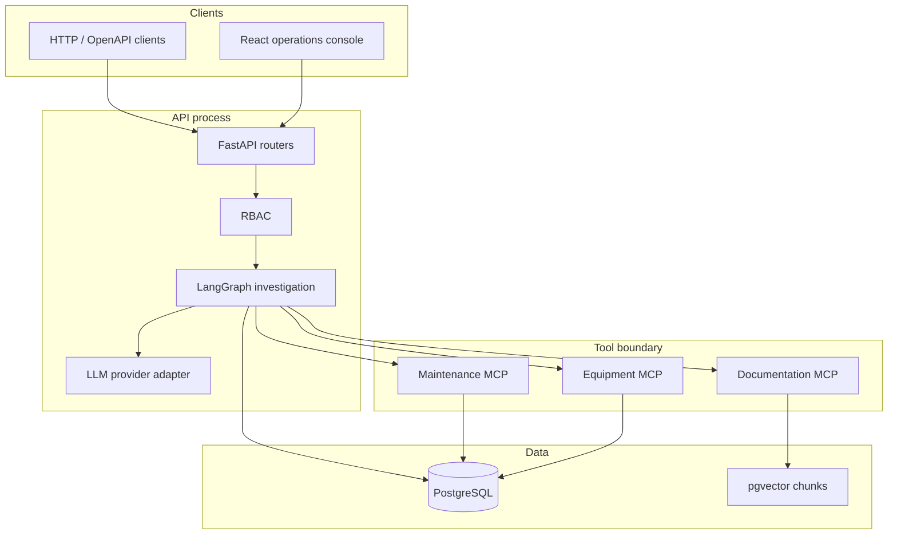

# Architecture

ForgeFlow AI is a modular monolith. One Python package (`forgeflow`) owns domain logic, agent orchestration, retrieval, and security. Process entrypoints live under `apps/`. MCP servers may run as separate processes later, but they share the same package and database rather than becoming a microservice mesh.

## Milestone 3 scope

Implemented now:

- FastAPI application factory with `/api/v1/health` and `/api/v1/ready`
- Equipment registry and history APIs under `/api/v1/equipment`
- Investigation API `POST /api/v1/investigations`
- MCP equipment and maintenance servers wrapping `IndustrialQueryService`
- LangGraph investigation graph with explicit nodes
- LLM provider adapters: OpenAI, Ollama, in-process mock
- Pydantic Settings loaded from the environment
- Async SQLAlchemy engine and session factory
- Alembic migrations, including `CREATE EXTENSION vector` and industrial tables
- Deterministic synthetic seed (CNC-042 overheating scenario)
- Structured JSON logging and request IDs
- Docker Compose services: `postgres`, `api`

Not implemented: RAG / documentation MCP, human approval, authn/z, UI, evals, OpenTelemetry.

## Target runtime

## Design rules

1. **The LLM is not a security boundary.** Authorization, write-action gating, and schema validation happen in application code.
2. **External content is untrusted.** Manuals, telemetry labels, and tool payloads cannot override system instructions.
3. **Write actions require deterministic policy plus human approval.** The graph interrupts and resumes from PostgreSQL-backed checkpoints.
4. **Critical model outputs are Pydantic models.** Plans, evidence, risk, and reports are not parsed from free-form prose.
5. **Agent reasoning and tool execution stay separated.** The graph decides; MCP tools execute with explicit schemas and authz checks.
6. **Failures are visible.** Insufficient evidence is a first-class outcome, not a confident hallucination.

## Package map

| Path | Responsibility | First milestone |
| --- | --- | --- |
| `apps/api` | ASGI entrypoint | 0 |
| `forgeflow/api` | HTTP app, routes, error envelope | 0 |
| `forgeflow/config.py` | Settings | 0 |
| `forgeflow/db` | Engine, session, Alembic | 0 |
| `forgeflow/observability` | Logging (metrics in M9) | 0 |
| `forgeflow/domain` | Equipment, telemetry, work orders | 1 |
| `forgeflow/services` | Read queries for industrial data | 1 |
| `forgeflow/mcp` | MCP servers and tool schemas | 2 |
| `forgeflow/agent` | LangGraph, providers, prompts | 3 |
| `forgeflow/retrieval` | Ingestion, embeddings, search | 4 |
| `forgeflow/security` | Authn, RBAC, tool authz | 6 |
| `apps/web` | Operations console | 7 |
| `evals` | Synthetic evaluation runner | 8 |

## HTTP API

Versioned under `/api/v1`. Milestone 3 exposes:

| Method | Path | Meaning |
| --- | --- | --- |
| GET | `/api/v1/health` | Process liveness; no database access |
| GET | `/api/v1/ready` | Readiness; `SELECT 1` against PostgreSQL |
| GET | `/api/v1/equipment` | List seeded assets |
| GET | `/api/v1/equipment/{code}` | Equipment by code or UUID |
| GET | `/api/v1/equipment/{code}/sensor-history` | Telemetry; default last 30 days |
| GET | `/api/v1/equipment/{code}/alarm-history` | Alarms; default last 30 days |
| GET | `/api/v1/equipment/{code}/maintenance-history` | Maintenance records |
| GET | `/api/v1/equipment/{code}/work-orders` | Work orders for the asset |
| POST | `/api/v1/investigations` | Run the LangGraph investigation |
| GET | `/docs` | OpenAPI Swagger UI |
| GET | `/openapi.json` | OpenAPI schema |

Errors use `{ "error": { "code", "message", "details?" } }`. An investigation that cannot support a cause still returns HTTP 200 with `report.evidence_sufficient = false`.

## MCP tools

Equipment and maintenance capabilities are MCP tools, not ad-hoc SQL from the graph. The API process hosts in-process MCP servers and invokes them through `McpToolGateway`. Tests can also connect with the MCP `ClientSession` over in-memory streams.

| Tool | Server | Data |
| --- | --- | --- |
| `get_equipment` | `forgeflow-equipment` | One asset by code or UUID |
| `get_sensor_history` | `forgeflow-equipment` | Telemetry window |
| `get_alarm_history` | `forgeflow-equipment` | Alarm window |
| `get_maintenance_history` | `forgeflow-maintenance` | Maintenance records |

Each call is schema-validated, timed, logged, and passed through an authorization hook (allow-all until Milestone 6).

## Investigation graph

Linear LangGraph nodes: `analyze_request` → `create_plan` → `resolve_equipment` → `retrieve_telemetry` → `retrieve_alarms` → `retrieve_maintenance` → `evaluate_evidence` → `generate_report`. If equipment cannot be resolved, retrieval is skipped. Operational facts are computed in code; the model fills structured plan/analysis fields and report prose.

## Persistence

PostgreSQL is the system of record for operational data, checkpoints, audit events, and embeddings. pgvector is enabled in the first migration. Milestone 1 adds `equipment`, `sensor_readings`, `alarms`, `maintenance_records`, and `work_orders`.

Synthetic catalogs live in `sample_data/`. Hourly telemetry is generated at seed time by `python -m forgeflow.domain.seed`.

## Configuration

Settings are loaded by `pydantic-settings`. `DATABASE_URL` may be `postgresql://` or `postgresql+asyncpg://`; the application normalizes to asyncpg. `LLM_PROVIDER` is `openai`, `ollama`, or `mock`. `FORGEFLOW_AS_OF` pins the investigation clock to the synthetic plant (default in `.env.example`).

See [local-development.md](local-development.md) and [adr/](adr/).
